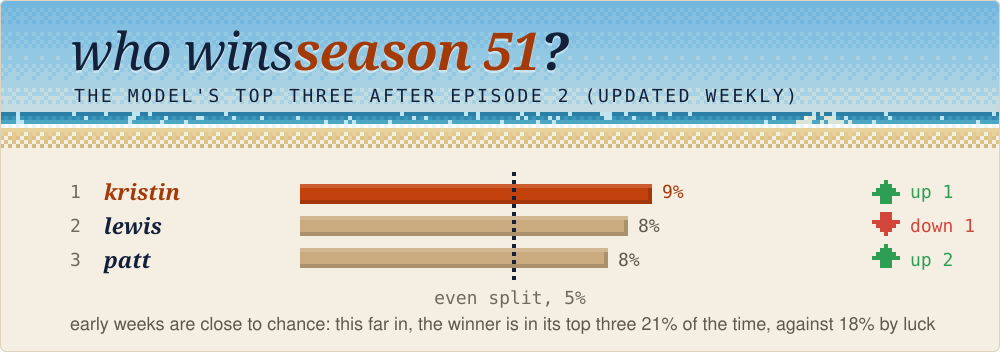
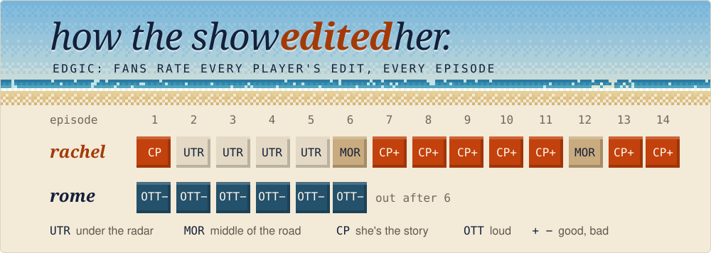
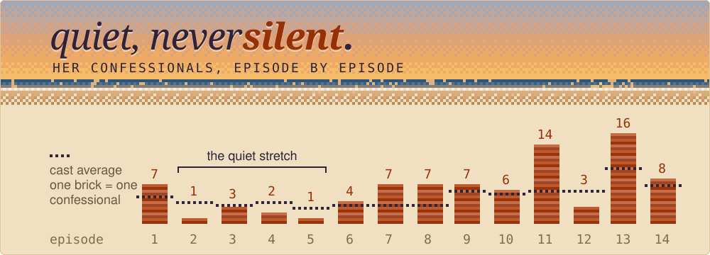
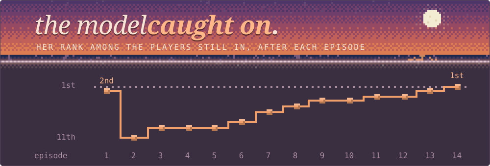
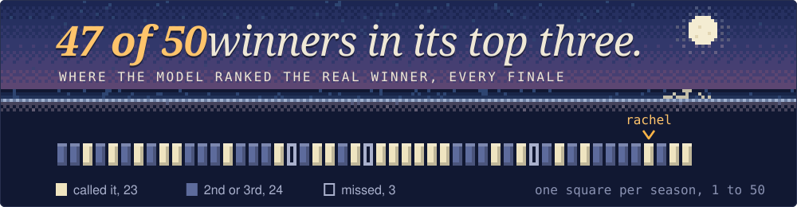
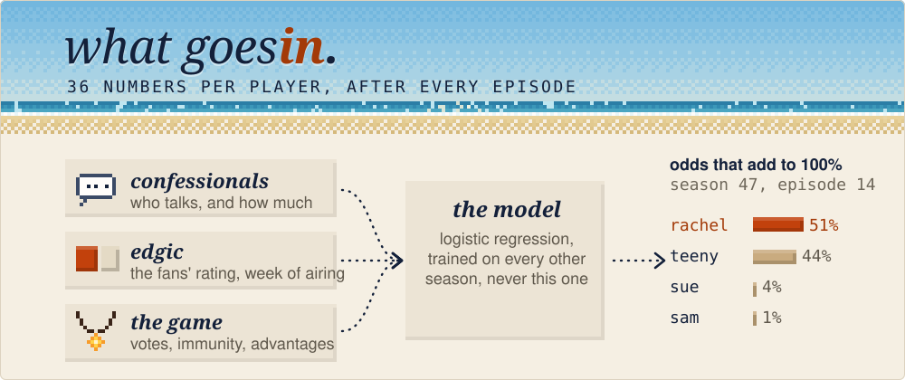
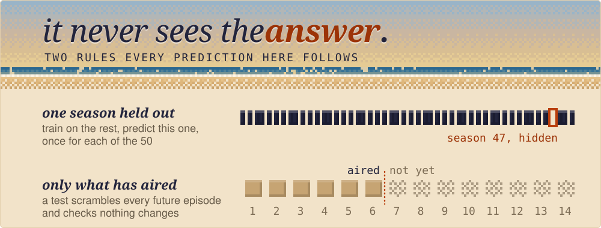
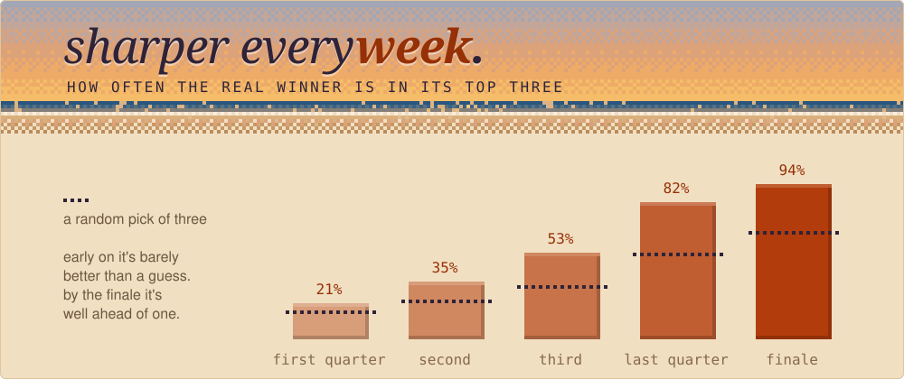
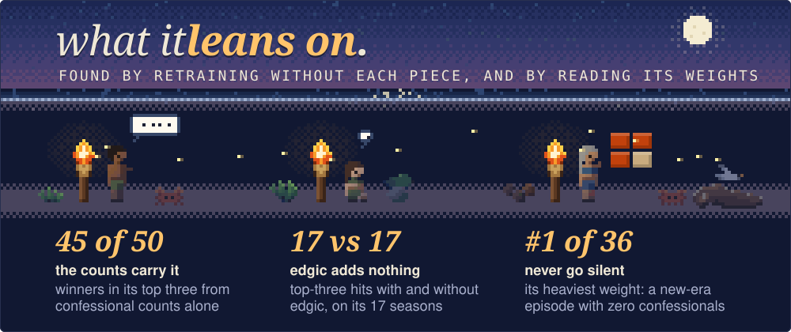
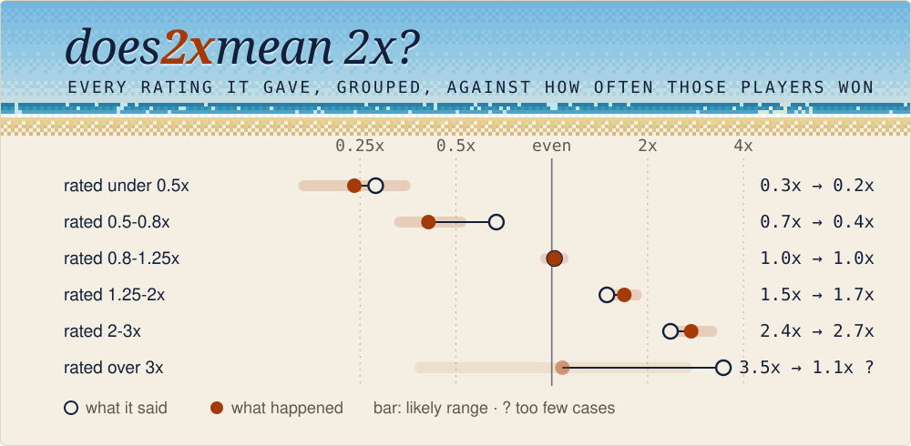

Can you tell who wins Survivor from how the show is edited? Better than chance,
anyway. Going into the finale, the model's #1 pick was the real winner in 23
of 50 seasons, about twice what a random guess gets (about 11). The winner was
in its top three 47 times, against about 33 by chance.

This is a backtest. Every prediction is out of sample (each season is
predicted by a model that never trained on it), but the model was designed
with all 50 seasons in view, so treat the numbers as somewhat optimistic.
[How far to trust it](#how-far-to-trust-it) has the luck odds, an ablation
and a calibration check. Season 51 is the clean test: the model is frozen and
[its weekly calls are logged](#the-forward-test-season-51) before anyone
knows who wins.

<!-- live:start -->
<!-- generated by scripts/story.py from docs/data/seasons. rerun it after each site export. -->
[](https://amonsalve1.github.io/snuff_ml/#s51/ep2)

**[See the full board for season
51](https://amonsalve1.github.io/snuff_ml/#s51/ep2)**. The site also replays
every finished season episode by episode, shows why the model rates each player
the way it does, and puts every castaway's seasons on one chart.
<!-- live:end -->

<!-- story:start -->
<!-- generated by scripts/story.py from the backtest. edit the script, not this block. -->
## One season, start to finish

Rachel won Survivor 47. This is a replay, not a record: a model that never
trained on her season, fed one episode at a time and only what had aired by
then. The model itself was built in 2026 with all 50 seasons in view, so treat
this as a backtest.


Edgic is the fans' weekly rating of every player's edit: under the radar,
middle of the road, complex (the story is about you) or over the top, plus
whether it reads good or bad. It's human-coded, so it's a judgment call, not a
count. Rachel went under the radar for episodes 2 to 5 and was mostly complex
and positive after that. Rome was over the top and negative every single week.
He was the model's #1 after episodes 4 and 5, and he went out in 6.

<picture>
  <source media="(max-width: 700px)" srcset="docs/story/2-how-the-show-edited-her-phone.svg">
  
</picture>

Confessionals are the talking-head interviews. In the quiet stretch she got 1
to 3 an episode, under the cast average, but never zero. In the new era only 1
of 10 winners has had an episode with none, against 21 of 39 of the other
players who lasted as long.



So the model never wrote her off. She was 2nd after the premiere, 11th of 17 at
her low point, and climbed steadily until its last snapshot had her first at
51%.



Rachel is one season of 50. Here's where the real winner ranked in the model's
last snapshot of every season, with 3 to 6 players left.

<picture>
  <source media="(max-width: 700px)" srcset="docs/story/5-every-finale-phone.svg">
  
</picture>

## How it works

The short version, in four pictures.

After every episode, each player still in the game becomes 36 numbers: how much
they talk and when (counted), how fans graded their edit that week (human-coded
edgic, only for 17 of the 50 seasons), and how they're playing. A logistic
regression scores everyone, and the scores get rescaled within the season so
they add to 100%, because there's exactly one winner. New-era seasons (41 on)
also blend in a model trained on that era alone.



Every prediction here is out of sample: each season is predicted by a model
that never trained on it, and every feature only uses episodes that had aired
by then. Edgic ratings written after a finale don't count either, because most
of the charts online were made by people who already knew the winner. One
honest caveat: the design (which features to keep, where to blend, which
seasons to leave out of training) was chosen while looking at results across
all 50 seasons, so these numbers are somewhat optimistic. Season 51 is the
clean test, further down.



It isn't psychic. In the first quarter of a season it's about as good as
picking three names out of a hat. It gets sharper as the edit fills in, and the
dotted line on each bar is what a random pick of three would get at that point.



What actually carries it, found by retraining with pieces taken away (the full
table is below). Confessional counts alone get 45 winners into its top three.
Adding the human-coded edgic changes nothing on the 17 seasons that have it.
And its single heaviest weight is a new-era episode with zero confessionals:
winners are rarely the loudest, but they're almost never silent.



Every season's full chart, every player's line, is in [the backtest
poster](docs/infographic.png).
<!-- story:end -->

<!-- trust:start -->
<!-- generated by scripts/story.py from `snuffml audit`. edit the script, not this block. -->
## How far to trust it

Everything in this section comes from `uv run snuffml audit`, on the same
leave-one-season-out runs as the rest. Chance means a random pick among whoever
was left at the model's last snapshot of the season.

**Is it luck?**

| claim | got | chance expects | odds of doing this well by luck |
|---|---|---|---|
| its #1 pick won | 23 of 50 | 10.8 | 1 in 9,400 |
| winner in its top three | 47 of 50 | 32.6 | 1 in 1,000,000 |
| new era (41-50): winner in its top three | 10 of 10 | 6.1 | 1 in 130 |
| new era: its #1 pick won | 4 of 10 | 2.0 | 1 in 8, so not evidence |

**What carries it.** Retrain from scratch with only some of the inputs.
Log-loss skill is how much better its odds are than an even split, averaged
over every episode (0 is no better, 1 is perfect); the last two columns are the
17 seasons that have edgic.

| inputs | #1 pick won | winner in top 3 | log-loss skill | edgic seasons: #1 / top 3 | edgic seasons: skill |
|---|---|---|---|---|---|
| immunity only | 20 of 50 | 32 of 50 | -0.006 | 6 / 10 | -0.016 |
| game stats only | 23 of 50 | 42 of 50 | 0.033 | 6 / 13 | 0.012 |
| confessionals only | 22 of 50 | 45 of 50 | 0.054 | 9 / 17 | 0.126 |
| confessionals + game stats | 22 of 50 | 46 of 50 | 0.090 | 6 / 17 | 0.159 |
| + edgic (the full model) | 23 of 50 | 47 of 50 | 0.075 | 6 / 17 | 0.116 |

Confessional counts do most of the work: on their own they get 45 of 50 winners
into the top three. "Isn't this just whoever won late immunity?" Partly, for
the final pick: immunity stats alone call 20 of 50, because finale winners
often win the last immunity. But they can't rank a field (32 of 50 in the top
three, about chance) and their skill is -0.006. Edgic is human-coded, by fans
who know the "winner's edit" theory, which is why it's worth checking: on the
17 seasons that have it, adding it makes the same picks and worse odds (0.116
against 0.159), and across all 50 seasons it drags skill from 0.090 to 0.075.
It stays in the published model for now, but the edit signal here is the
counts, not the fans' reading of them.

**Four models, same folds.**

| model | #1 pick won | winner in top 3 | log-loss skill |
|---|---|---|---|
| logistic regression | 20 of 50 | 47 of 50 | 0.075 |
| gradient boosting | 17 of 50 | 45 of 50 | 0.029 |
| GRU (PyTorch) | 22 of 50 | 42 of 50 | 0.026 |
| blend (published) | 23 of 50 | 47 of 50 | 0.075 |

Plain logistic regression is as good as anything here on log-loss. The blend's
extra calls (23 against 20) come from a design choice made with every season
visible, so treat them as optimistic. The GRU, the one deep model, loses to
plain logistic regression on skill (0.026 against 0.075).

**The two seasons left out of training.**

| training | #1 pick won | top 3 | skill | new era #1 / top 3 |
|---|---|---|---|---|
| S38 and S41 left out (published) | 23 of 50 | 47 of 50 | 0.075 | 4 / 10 of 10 |
| S41 kept in training | 22 of 50 | 44 of 50 | 0.056 | 2 / 9 of 10 |
| both kept in training | 22 of 50 | 45 of 50 | 0.059 | 2 / 9 of 10 |

S41 was left out because keeping it hurt the other new-era seasons, and that
was decided while looking at them. With it kept in, the model calls 22 of 50
and only 2 of 10 in the new era, against 4 published. That gap is the size of
the optimism.

**Does 2x mean 2x?**



Around an even split it's spot on (1.02x said, 1.02x happened). Further out
it's too cautious: players it rated 1.5x won like 1.7x players. Its rare
boldest calls, above 3x, are too few to judge.

**The episode-4 flag, checked.** The confessional leader through episode 4 of a
new-era season has never won. Here's the same count at episodes 3, 4 and 5, in
every era:

| era | leader won, ep 3 | ep 4 | ep 5 | chance expects (ep 4) |
|---|---|---|---|---|
| old | 1 of 20 | 1 of 20 | 2 of 20 | 1.4 |
| middle | 2 of 20 | 2 of 20 | 3 of 20 | 1.3 |
| new | 0 of 10 | 0 of 10 | 2 of 10 | 0.7 |

Zero of ten sounds damning, but chance alone expects less than one, and gives
zero about 50% of the time. At episode 5, two of the ten leaders won. The model
leans on it anyway (it's the 4th heaviest of its 36 weights), which makes it
the likeliest place it has fit noise. Expect that weight to shrink as seasons
are added.
<!-- trust:end -->

<!-- forward:start -->
<!-- generated by scripts/story.py from forward/. edit the script, not this block. -->
## The forward test: season 51

Everything above is a backtest: it was built with every season in view, so it
can only ever be a replay. This part can't be tuned after the fact. The model
was frozen on 2026-10-03 at commit `d3a13dd` (sha256 `9fd9a1daf5ff…`, the file
is in `forward/`). It predicts season 51 after every episode, before anyone
knows who wins, and each week's board is appended to
[`forward/s51.csv`](forward/s51.csv) and never edited. The site uses the same
frozen file.

| after episode | 1st | 2nd | 3rd | even split | logged |
|---|---|---|---|---|---|
| 1 | Lewis 7.8% | Kristin 7.6% | Jelly 6.5% | 4.8% | 2026-10-03 |
| 2 | Kristin 8.8% | Lewis 8.2% | Patt 7.7% | 5.0% | 2026-10-03 |

The early weeks are close to chance: in a season's first quarter the winner is
in its top three 21% of the time, against 18% by luck, so read a 9% against 8%
race as a coin toss. Episodes 1 and 2 were logged together on 2026-10-03, after
episode 2 aired; every later episode is logged the week it airs. When the
season ends, this is the first result here that couldn't have been fit to the
answer.
<!-- forward:end -->

## Why I built it

This started as a way to work through Machine Learning with PyTorch &
Scikit-Learn on a dataset I actually care about, so the modeling goes sklearn
first, then a small PyTorch model. Two things it can do:

- rank every remaining player's win probability after each episode of an
  airing season
- a retrospective study over all 50 finished seasons of which edit features
  actually predict winners (output lands in `reports/retrospective/`)
- a forward test: a frozen copy of the model logs its season 51 calls every
  week, so there's one result nobody could have tuned

## Run it

```bash
uv sync
uv run snuffml fetch                 # pull the survivoR data
uv run snuffml build                 # build the feature panel
uv run snuffml predict --season 51
uv run snuffml backtest --season 45  # replay a season out-of-sample
uv run snuffml study --loso          # rerun the leave-one-season-out study
uv run snuffml audit                 # ablation, model leaderboard, luck odds, calibration
uv run python scripts/forward_log.py # log the frozen model's season 51 calls
uv run python scripts/story.py       # redraw the README from the study and audit
uv run pytest -m "not slow"
```

Needs Python 3.12+.

## Data

Main source is the [survivoR](https://github.com/doehm/survivoR) R package,
read straight from the json in its repo (the
[survivoR2py](https://github.com/stiles/survivoR2py) csv mirror is the
fallback, it stopped updating). Confessional counts per player per episode
back to season 1, plus boot order, votes, jury votes and advantages.
`snuffml fetch` caches it under `data/raw/`.

Edgic ratings (the CP/MOR/UTR/OTT codes with tone and visibility) have no
single public dataset, so there are two scrapers: the weekly charts Inside
Survivor published for roughly S31-S39, and the r/Edgic community survey
sheets for S41-S50. Hand-typed CSVs in `data/manual/edgic/` also work. One
thing I care about here: most edgic charts you find online were written by
people who already knew the winner. Every rating row carries a
`contemporaneous` flag and only ratings made week-of-airing go into the
features by default (which is why the S50 chart, compiled after the finale,
is stored but unused).

Edgic is human-coded, and that matters more than leakage does. Deciding
whether a player's story is complex or middle-of-the-road takes
interpretation, and the people rating know the "winner's edit" theory as well
as anyone, so ambiguous scenes can lean toward whoever they already suspect.
Averaging many raters cancels one person's noise, not a belief they all
share. Confessional counts don't have that problem: anyone counting gets the
same number. The [ablation](#how-far-to-trust-it) checks whether edgic earns
its place (on this data, it doesn't).

## Modeling notes

<details>
<summary>the four models, the two outlier seasons, and what the data taught me</summary>

There's exactly one winner per season, so treating this as normal binary
classification is wrong. Instead the models score every player still alive at
each episode snapshot and the probabilities get renormalized within the
season. All cross-validation splits by season, and the headline numbers are
leave-one-season-out. Accuracy is a useless metric at this class balance, so
everything is reported as rank-of-winner, top-k, and log-loss skill against a
uniform baseline.

Four models, pick with `--model` (the [leaderboard](#how-far-to-trust-it)
compares them on the same folds):

- `blend` (default): geometric mean of the pooled logit and a new-era-only
  logit. The new era is edited differently enough that it earns its own
  model, but only ~9 usable seasons exist, so blending with the pooled model
  keeps the calibration. Old and middle era predictions stay pooled, blending
  those tested worse.
- `logit`: plain logistic regression, easy to interpret
- `hgb`: gradient boosting
- `gru`: per-player GRU over the episode sequence with a masked softmax over
  the season roster, averaged over seeds

Seasons 38 and 41 are treated as outliers: still predicted and scored, never
learned from. That choice was made while looking at results, and the audit
reports the numbers with S41 kept in too. Chris won season 38 from the edge
of extinction after being voted out in episode 3, so his winner rows teach
nothing real. Erika won 41 off the lowest confessional share of any winner
while the edit pointed at everyone else, and keeping that season in training
measurably dragged down the fit on every other new-era season.

Some things the data taught me:

- Immunity timing matters more than immunity counts. Late-merge immunity wins
  point at the winner in every era, and winning early in the merge is a threat
  signal that old-era winners specifically avoided (they won less early
  immunity than losing finalists). On its own, though, immunity only picks the
  finale winner: it can't rank a field (see the ablation).
- Zero-confessional episodes are only a red flag in the new era. Old-era
  winners had them all the time, so the feature has an era interaction.
- The winner's original tribe over-indexes on pre-merge confessionals. Small
  but real. Current-tribe share tested neutral, so it's built for the study
  but kept out of the model.

</details>

## What doesn't work yet

Only three winners finished outside its top three. Natalie White (S19) and
Denise (S25) are the two winners fans call invisible, so if the model is
reading the edit, those are exactly the ones it should miss. Chris (S38) came
back from Edge of Extinction, which is why his season is never trained on.

The near misses, where the winner came 2nd, are nearly all the same shape: a
big strategist-narrator gets the confessional volume and outranks a
jury-beloved winner (Carson over Yam Yam, Austin over Dee, Charlie over
Kenzie). What separates those pairs is what other players say about them, and
nothing in confessional counts or edgic codes captures that. Episode
transcripts exist for almost every season, so a who-mentions-whom dataset is
the obvious next data project. Old-era edgic (S4-S30) also survives as raw
weekly ballots on the Survivor Sucks forum archive, but scraping thousands of
forum pages is a project for another month.

Three things the [audit](#how-far-to-trust-it) turned up that I haven't fixed:

- Edgic doesn't earn its place. It's still in the published model, but on the
  seasons that have it, the model does as well or better without it.
- The odds are too cautious at the edges. Players it rates well above an even
  split win more often than it says, so the probabilities could be stretched.
- It probably fit some noise. Its fourth-heaviest weight is the episode-4
  confessional leader in the new era, a pattern chance produces half the
  time. The forward test will show whether that holds up.

## Layout

<details>
<summary>where things live</summary>

```
src/snuffml/
  config.py        paths, eras, name aliases
  data/            survivoR ingestion, edgic scrapers
  features/        panel, edit, gameplay, edgic, build
  models/          sklearn_baseline, torch_seq, normalize
  eval/            splits, metrics, backtest, study, audit
  report.py, cli.py
tests/
scripts/           the README story, the forward log and the backtest poster
forward/           the frozen model, its hash, and the season 51 log
```

The tests run on synthetic fixture seasons, no network needed. The one to know
about is `test_leakage.py`: it rebuilds the features with all future episodes
scrambled (different winner included) and asserts the past features come out
bit-identical. If a new feature breaks that test it's peeking at the future.

</details>

## Credits

All the underlying data comes from communities that counted things for years
because they love this show: Dan Oehm's [survivoR](https://github.com/doehm/survivoR)
package and its confessional counters, [Inside Survivor](https://insidesurvivor.com)'s
edgic articles, and the r/Edgic survey sheets. This project just does math on
top of their work.

The code is MIT licensed (see [LICENSE](LICENSE)). The data belongs to its
sources: survivoR, Inside Survivor and the r/Edgic contributors.
