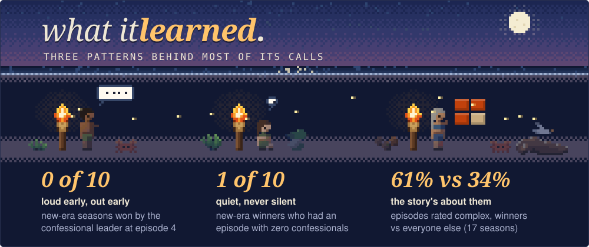

Can you tell who wins Survivor from how the show is edited? Better than
chance, anyway. Going into the finale, with 3 to 6 players left, the model's
#1 pick was the real winner in 23 of 50 seasons. Picking a name at random gets
about 11. The winner was in its top three 47 times, against about 33 by
chance. In the new era (41-50) it called 4 of 10 against about 2, and had the
winner in its top three every time. Every prediction below is out of sample:
the model never saw the season it's predicting.

<!-- live:start -->
<!-- generated by scripts/story.py from docs/data/seasons. rerun it after each site export. -->
[](https://amonsalve1.github.io/snuff_ml/#s51/ep2)

**[See the full board for season
51](https://amonsalve1.github.io/snuff_ml/#s51/ep2)**. The site also replays
every finished season episode by episode, shows why the model rates each player
the way it does, and compares eras.
<!-- live:end -->

<!-- story:start -->
<!-- generated by scripts/story.py from the backtest. edit the script, not this block. -->
## one season, start to finish

Rachel won Survivor 47. The model never trained on her season, so everything
below is what it actually thought at the time, one episode at a time.


Edgic is the fans' weekly rating of every player's edit: under the radar,
middle of the road, complex (the story is about you) or over the top, plus
whether it reads good or bad. Rachel went under the radar for episodes 2 to 5
and was mostly complex and positive after that. Rome was over the top and
negative every single week. He was the model's #1 after episodes 4 and 5, and
he went out in 6.


Confessionals are the talking-head interviews. In the quiet stretch she got 1
to 3 an episode, under the cast average, but never zero. That matters: only 1
of 10 new-era winners has had an episode with none.


So the model never wrote her off. She was 2nd after the premiere, 11th of 17 at
her low point, and climbed steadily until its last snapshot had her first at
51%.


Rachel is one season out of 50. Going into the finale, with 3 to 6 players
left, the model's #1 pick was the real winner 23 times. Picking a name at
random gets about 11. The winner was in its top three 47 times, against about
33 by chance.


## how it works

The short version, in four pictures.

After every episode, each player still in the game becomes 36 numbers: how much
they talk and when, how the fans rated their edit that week, and how they are
playing. A logistic regression scores everyone, and the scores get rescaled
within the season so they add to 100%, because there's exactly one winner.
New-era seasons (41 on) also blend in a model trained on that era alone.


Every number in this README is out of sample. Each season is predicted by a
model that never saw it, and every feature only uses episodes that had aired by
then. Edgic ratings written after a finale don't count either, because most of
the charts online were made by people who already knew the winner.


It isn't psychic. In the first quarter of a season it's about as good as
picking three names out of a hat. It gets sharper as the edit fills in, and the
dotted line on each bar is what a random pick of three would get at that point.


Most of its calls come down to three patterns. The editors crown an early
frontrunner just to take them down. Winners are rarely the loudest, but they
are almost never silent. And by the end, the story is about them.



Every season's full chart, every player's line, is in [the backtest
poster](docs/infographic.png).
<!-- story:end -->

## why i built it

This started as a way to work through Machine Learning with PyTorch &
Scikit-Learn on a dataset I actually care about, so the modeling goes sklearn
first, then a small PyTorch model. Two things it can do:

- rank every remaining player's win probability after each episode of an
  airing season
- a retrospective study over all 50 finished seasons of which edit features
  actually predict winners (output lands in `reports/retrospective/`)

## run it

```bash
uv sync
uv run snuffml fetch                 # pull the survivoR data
uv run snuffml build                 # build the feature panel
uv run snuffml predict --season 51
uv run snuffml backtest --season 45  # replay a season out-of-sample
uv run snuffml study --loso          # rerun the full study (slow)
uv run python scripts/story.py       # redraw the README story from the study
uv run pytest -m "not slow"
```

Needs Python 3.12+.

## data

Main source is the [survivoR](https://github.com/doehm/survivoR) R package,
read straight from the json in its repo (the
[survivoR2py](https://github.com/stiles/survivoR2py) csv mirror is the
fallback, it stopped updating). Confessional counts per player per episode
back to season 1, plus boot order, votes, jury votes and advantages.
`snuffml fetch` caches it under `data/raw/`.

Edgic ratings (the CP/MOR/UTR/OTT codes with tone and visibility) have no
single public dataset, so there are two scrapers: the weekly charts Inside
Survivor published for roughly S31-S39, and the r/Edgic community survey
sheets for S41-S50. Hand-typed CSVs in `data/manual/edgic/` also work. One
thing I care about here: most edgic charts you find online were written by
people who already knew the winner. Every rating row carries a
`contemporaneous` flag and only ratings made week-of-airing go into the
features by default (which is why the S50 chart, compiled after the finale,
is stored but unused).

## modeling notes

<details>
<summary>the four models, the two outlier seasons, and what the data taught me</summary>

There's exactly one winner per season, so treating this as normal binary
classification is wrong. Instead the models score every player still alive at
each episode snapshot and the probabilities get renormalized within the
season. All cross-validation splits by season, and the headline numbers are
leave-one-season-out. Accuracy is a useless metric at this class balance, so
everything is reported as rank-of-winner, top-k, and log-loss skill against a
uniform baseline.

Four models, pick with `--model`:

- `blend` (default): geometric mean of the pooled logit and a new-era-only
  logit. The new era is edited differently enough that it earns its own
  model, but only ~9 usable seasons exist, so blending with the pooled model
  keeps the calibration. Old and middle era predictions stay pooled, blending
  those tested worse.
- `logit`: plain logistic regression, easy to interpret
- `hgb`: gradient boosting
- `gru`: per-player GRU over the episode sequence with a masked softmax over
  the season roster, averaged over seeds

Seasons 38 and 41 are treated as outliers: still predicted and scored, never
learned from. Chris won season 38 from the edge of extinction after being
voted out in episode 3, so his winner rows teach nothing real. Erika won 41
off the lowest confessional share of any winner while the edit pointed at
everyone else, and keeping that season in training measurably dragged down
the fit on every other new-era season.

Some things the data taught me:

- Immunity timing matters more than immunity counts. Late-merge immunity wins
  point at the winner in every era. Winning early in the merge is a threat
  signal that old-era winners specifically avoided (they won less early
  immunity than losing finalists). Biggest single gain in matched cv.
- Zero-confessional episodes are only a red flag in the new era. Old-era
  winners had them all the time, so the feature has an era interaction.
- The winner's original tribe over-indexes on pre-merge confessionals. Small
  but real. Current-tribe share tested neutral, so it's built for the study
  but kept out of the model.

</details>

## what doesn't work yet

Only three winners finished outside its top three. Natalie White (S19) and
Denise (S25) are the two winners fans call invisible, so if the model is
reading the edit, those are exactly the ones it should miss. Chris (S38) came
back from Edge of Extinction, which is why his season is never trained on.

The near misses, where the winner came 2nd, are nearly all the same shape: a
big strategist-narrator gets the confessional volume and outranks a
jury-beloved winner (Carson over Yam Yam, Austin over Dee, Charlie over
Kenzie). What separates those pairs is what other players say about them, and
nothing in confessional counts or edgic codes captures that. Episode
transcripts exist for almost every season, so a who-mentions-whom dataset is
the obvious next data project. Old-era edgic (S4-S30) also survives as raw
weekly ballots on the Survivor Sucks forum archive, but scraping thousands of
forum pages is a project for another month.

## layout

<details>
<summary>where things live</summary>

```
src/snuffml/
  config.py        paths, eras, name aliases
  data/            survivoR ingestion, edgic scrapers
  features/        panel, edit, gameplay, edgic, build
  models/          sklearn_baseline, torch_seq, normalize
  eval/            splits, metrics, backtest, study
  report.py, cli.py
tests/
scripts/           the README story and the backtest poster
```

The tests run on synthetic fixture seasons, no network needed. The one to know
about is `test_leakage.py`: it rebuilds the features with all future episodes
scrambled (different winner included) and asserts the past features come out
bit-identical. If a new feature breaks that test it's peeking at the future.

</details>

## credits

All the underlying data comes from communities that counted things for years
because they love this show: Dan Oehm's [survivoR](https://github.com/doehm/survivoR)
package and its confessional counters, [Inside Survivor](https://insidesurvivor.com)'s
edgic articles, and the r/Edgic survey sheets. This project just does math on
top of their work.
