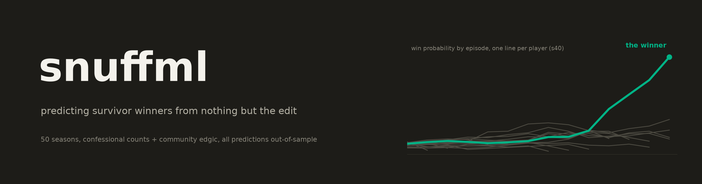
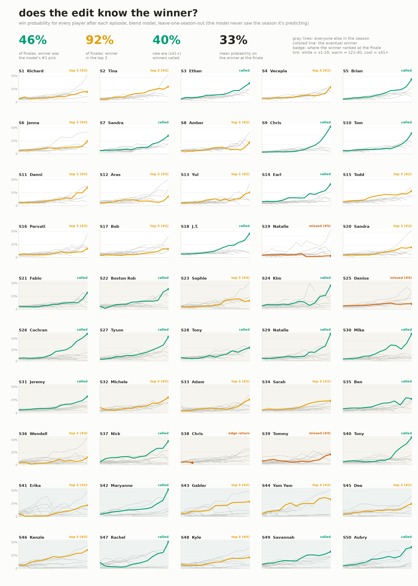

Can you tell who wins Survivor just from how the show is edited? Mostly, yes.
Confessional counts plus community edgic ratings get the eventual winner into
the model's top 3 at 94% of finales, and make them the outright #1 pick at
44% of them. Every prediction below is out-of-sample: the model never saw the
season it's predicting.

**[Explore it interactively](https://amonsalve1.github.io/snuff_ml/)**: replay
any season episode by episode, click a player to see why the model rates them,
compare eras, browse the decoys and hidden winners.



This started as a way to work through Machine Learning with PyTorch &
Scikit-Learn on a dataset I actually care about, so the modeling goes sklearn
first, then a small PyTorch model. Two things it can do:

- rank every remaining player's win probability after each episode of an
  airing season
- a retrospective study over ~46 finished seasons of which edit features
  actually predict winners (output lands in `reports/retrospective/`)

## Setup

```bash
uv sync
uv run snuffml fetch                 # pull the survivoR data
uv run snuffml build                 # build the feature panel
uv run snuffml predict --season 50
uv run snuffml backtest --season 45  # replay a season out-of-sample
uv run snuffml study --loso          # rerun the full study (slow)
uv run pytest -m "not slow"
```

Needs Python 3.12+.

## Data

Main source is the [survivoR](https://github.com/doehm/survivoR) R package,
read straight from the json in its repo (the
[survivoR2py](https://github.com/stiles/survivoR2py) csv mirror is the
fallback, it stopped updating). Confessional counts per player per episode
back to season 1, plus boot order, votes, jury votes and advantages.
`snuffml fetch` caches it under `data/raw/`.

Edgic ratings (the CP/MOR/UTR/OTT codes with tone and visibility) have no
single public dataset, so there are two scrapers: the weekly charts Inside
Survivor published for roughly S31-S39, and the r/Edgic community survey
sheets for S41-S50. Hand-typed CSVs in `data/manual/edgic/` also work. One
thing I care about here: most edgic charts you find online were written by
people who already knew the winner. Every rating row carries a
`contemporaneous` flag and only ratings made week-of-airing go into the
features by default (which is why the S50 chart, compiled after the finale,
is stored but unused).

## Modeling notes

There's exactly one winner per season, so treating this as normal binary
classification is wrong. Instead the models score every player still alive at
each episode snapshot and the probabilities get renormalized within the
season. All cross-validation splits by season, and the headline numbers are
leave-one-season-out. Accuracy is a useless metric at this class balance, so
everything is reported as rank-of-winner, top-k, and log-loss skill against a
uniform baseline.

Four models, pick with `--model`:

- `blend` (default): geometric mean of the pooled logit and a new-era-only
  logit. The new era is edited differently enough that it earns its own
  model, but only ~9 usable seasons exist, so blending with the pooled model
  keeps the calibration. Old and middle era predictions stay pooled, blending
  those tested worse.
- `logit`: plain logistic regression, easy to interpret
- `hgb`: gradient boosting
- `gru`: per-player GRU over the episode sequence with a masked softmax over
  the season roster, averaged over seeds

Seasons 38 and 41 are treated as outliers: still predicted and scored, never
learned from. Chris won season 38 from the edge of extinction after being
voted out in episode 3, so his winner rows teach nothing real. Erika won 41
off the lowest confessional share of any winner while the edit pointed at
everyone else, and keeping that season in training measurably dragged down
the fit on every other new-era season.

Some things the data taught me:

- Immunity timing matters more than immunity counts. Late-merge immunity wins
  point at the winner in every era. Winning early in the merge is a threat
  signal that old-era winners specifically avoided (they won less early
  immunity than losing finalists). Biggest single gain in matched cv.
- New-era winners basically never have a zero-confessional episode (1 of 10
  through s50). Old-era winners had them all the time, so it's a flag with an
  era interaction.
- The player leading cumulative confessional share through episode 4 has
  never won a new-era season, 0 for 10. The editors crown an early
  frontrunner just to dethrone them around the merge or final seven.
- The winner's original tribe over-indexes on pre-merge confessionals. Small
  but real.
- Demographic and current-tribe-share columns tested neutral-to-negative as
  model inputs at this sample size, so they're built for the study but kept
  out of the model.

## What doesn't work yet

The misses are nearly all the same shape: a big strategist-narrator gets the
confessional volume and outranks a jury-beloved winner (Carson over Yam Yam,
Austin over Dee, Charlie over Kenzie). What separates those pairs is what
other players say about them, and nothing in confessional counts or edgic
codes captures that. Episode transcripts exist for almost every season, so a
who-mentions-whom dataset is the obvious next data project. Old-era edgic
(S4-S30) also survives as raw weekly ballots on the Survivor Sucks forum
archive, but scraping thousands of forum pages is a project for another
month.

## Layout

```
src/snuffml/
  config.py        paths, eras, name aliases
  data/            survivoR ingestion, edgic scrapers
  features/        panel, edit, gameplay, edgic, build
  models/          sklearn_baseline, torch_seq, normalize
  eval/            splits, metrics, backtest, study
  report.py, cli.py
tests/
scripts/           the infographic
```

The tests run on synthetic fixture seasons, no network needed. The one to know
about is `test_leakage.py`: it rebuilds the features with all future episodes
scrambled (different winner included) and asserts the past features come out
bit-identical. If a new feature breaks that test it's peeking at the future.

## Credits

All the underlying data comes from communities that counted things for years
because they love this show: Dan Oehm's [survivoR](https://github.com/doehm/survivoR)
package and its confessional counters, [Inside Survivor](https://insidesurvivor.com)'s
edgic articles, and the r/Edgic survey sheets. This project just does math on
top of their work.
